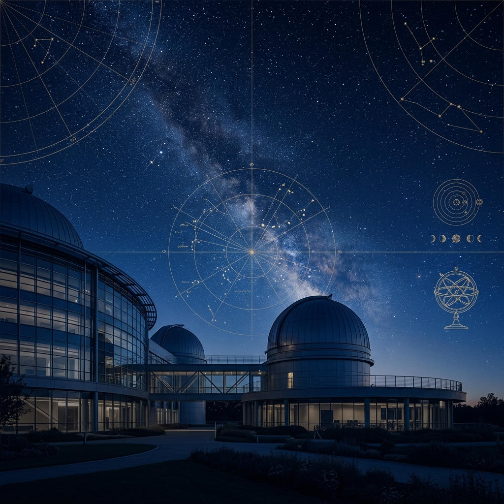

Bibliotheek KNA-RNAS Library
============================

**The KNA-RNAS Library** is the official Library of the Royal Netherlands Astronomical Society (Koninklijke Nederlandse Astronomen Club). The archive of physical documents is housed in xxxx. Approved electronic documents are given a DOI-number via Zenodo (CERN, Geneva, CH); Recurrent publications may be issued an ISSN by the National Library of the Netherlands.

.. note::

   This library is under active development, direct comments to librarian@kna-rnas.nl

.. grid:: 1 2 2 2
   :gutter: 3
   :margin: 4

   .. grid-item-card:: 🏛️ Governing Documents
      :shadow: md

      Official statutes, bylaws, and mission statement of the KNA-RNAS.
      
      +++
      - :doc:`Statutes <governing-docs/statutes>`
      - :doc:`Bylaws <governing-docs/bylaws>`
      - :doc:`Mission <governing-docs/mission>`
      - :doc:`KvK Registration <governing-docs/kvk-registration>`
      - :doc:`Fee Structure <governing-docs/membership-fee-structure>`
      - :doc:`Qualification <governing-docs/qualification>`

   .. grid-item-card:: 📚 Publications
      :shadow: md

      Periodicals and official publications distributed by the society.
      
      +++
      - :doc:`Newsletters <publications/newsletters>`
      - :doc:`Proceedings <publications/proceedings>`

   .. grid-item-card:: 📝 Minutes
      :shadow: md

      Records of society meetings and board gatherings.
      
      +++
      - :doc:`Meeting Minutes <minutes/meeting-minutes>`
      - :doc:`Board Minutes <minutes/board-minutes>`

   .. grid-item-card:: 🕰️ Historical Documents
      :shadow: md

      Archival materials marking key moments in the history of the KNA-RNAS.
      
      +++
      - :doc:`Royal Designation <historical-docs/royal-designation>`
      - :doc:`80 Jaar Vrijheid <historical-docs/80-jaar-vrijheid>`

   .. grid-item-card:: 📢 Official Communication
      :shadow: md

      Public announcements and official correspondence records.
      
      +++
      - :doc:`2025 Communications <communication/official-communication-2025>`
      - :doc:`2024 Communications <communication/official-communication-2024>`

.. toctree::
   :hidden:
   :caption: Governing Documents

   governing-docs/statutes
   governing-docs/bylaws
   governing-docs/mission
   governing-docs/kvk-registration
   governing-docs/membership-fee-structure
   governing-docs/qualification

.. toctree::
   :hidden:
   :caption: Publications

   publications/newsletters
   publications/proceedings

.. toctree::
   :hidden:
   :caption: Minutes

   minutes/meeting-minutes
   minutes/board-minutes

.. toctree::
   :hidden:
   :caption: Historical Documents

   historical-docs/royal-designation
   historical-docs/80-jaar-vrijheid

.. toctree::
   :hidden:
   :caption: Official Communication

   communication/official-communication-2025
   communication/official-communication-2024
   api